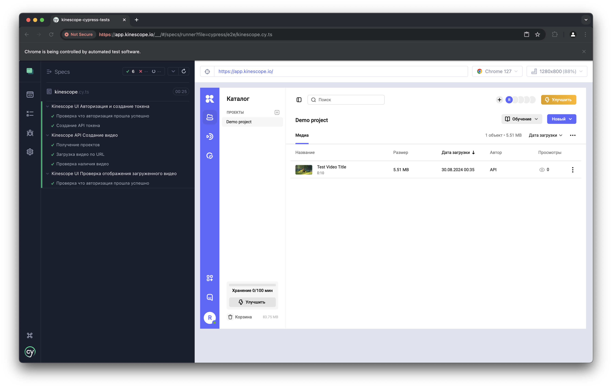

# Kinescope Cypress Tests

Этот репозиторий содержит автоматизированные тесты для Kinescope, написанные с использованием Cypress и TypeScript.
Тесты выполняют авторизацию, создание токена, загрузку видео и некоторые проверки.

## Установка

1. **Клонируйте репозиторий:**

   ```bash
   git clone https://github.com/ya-rtfmn/kinescope-cypress-tests.git
   cd kinescope-cypress-tests
   ```

2. **Установите зависимости:**

   ```bash
   npm install
   ```

## Настройка

Перед запуском тестов, выполните следующие настройки:

**Настройте учетные данные:**
   
Создайте файл .env следующего содержания в корне проекта
```bash
USERNAME=''
PASSWORD=''
```
заполните его вашими данными

## Запуск тестов

Для запуска тестов используйте следующую команду:

```bash
npx cypress open
```

Эта команда откроет графический интерфейс Cypress, где вы сможете выбрать и запустить свои тесты.

## Запуск в режиме CI

Если вы хотите запускать тесты в режиме CI, используйте:

```bash
npx cypress run
```

## Скриншот с результатами выполненных тестов

